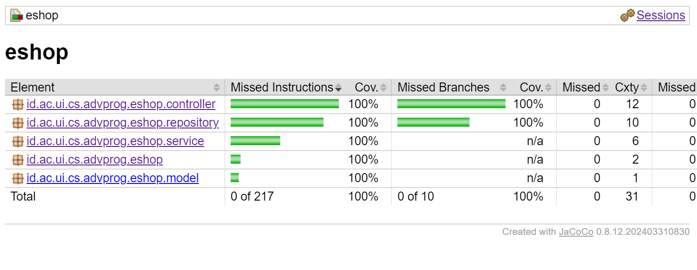

# Advanced Programing E-shop
Ivan Jehuda Angi - 2306152222 - Adpro A 
## Contents
1.  [Reflection 1](#reflection-1)
2. [Reflection 2](#reflection-2)
3. [Module 2 Reflection](#Module-2-Reflection)

## Reflection-1
### What I  learned?
During this exercise, I learned several important principles about writing clean code. One of the key takeaways is the importance of using meaningful variable names. Choosing clear and descriptive names for variables makes the code easier to read and understand, reducing the need for additional comments or explanations. Instead of using generic names like x or temp, it is better to use names that reflect the purpose of the variable, such as userAge or orderTotal.
- Example
    ```java
  public Product create(Product product);
    public List<Product> findAll();
    Product findById(String productId);
    Product update(Product product);
    boolean delete(String productId);

  ```
Another crucial principle is that functions should be small and focused on doing only one task. A function that tries to handle multiple responsibilities can quickly become difficult to maintain and debug. By keeping functions concise and ensuring they adhere to the Single Responsibility Principle, the code becomes more modular, reusable, and easier to test.
- Example
```java
public Product update(Product updatedProduct) {
    for (int i = 0; i < productData.size(); i++) {
        if (productData.get(i).getProductId().equals(updatedProduct.getProductId())) {
            productData.set(i, updatedProduct);
            return updatedProduct;
        }
    }
    return null;
}
  ```
The code also effectively organizes product-related logic within a Product class, rather than passing multiple unrelated values around.

- Example
```java
@Getter @Setter
public class Product {
    private String productId;
    private String productName;
    private int productQuantity;

    public Product() {
        this.productId = UUID.randomUUID().toString(); // Generate unique ID
    }
}
  ```

### Mistakes in the source code
In addition to these best practices, I also identified some mistakes in the source code and ways to improve it. One improvement is implementing input validation. Without proper validation, the program may accept incorrect or unexpected inputs, leading to errors or security vulnerabilities. Adding checks for valid input formats and constraints can make the program more robust and reliable.

Another improvement is the use of comments to enhance code readability. While clean and well-structured code should be self-explanatory, comments can still be valuable in explaining complex logic, outlining function purposes, or providing context for future developers. 

# Reflection-2
## How I feel after making the unit test
Writing unit tests has given me greater confidence in my code by allowing me to confirm that each function behaves as intended. Through this process, I gained a deeper understanding of my program's structure and identified potential issues that could occur during execution. Moreover, troubleshooting failed tests offered valuable insights into edge cases I had not previously considered.
## How many unit test should be made
The number of unit tests in a class depends on the complexity and functionality of the class. Ideally, every function should have at least one test, but for functions with multiple possible inputs and edge cases, multiple test cases are necessary. A good approach is to use the Arrange-Act-Assert pattern to systematically cover different behaviors, including:
- Valid inputs (ensuring expected outputs)
- Invalid inputs (verifying error handling)
- Boundary cases (testing extreme values)
## How to make sure that our unit tests are enough to verify our program?
  One way to ensure adequate testing is to use code coverage analysis. Code coverage measures how much of your code is executed when running the test suite. There are different types of coverage:

- Statement coverage: Checks if each line of code is executed.
- Branch coverage: Ensures that every possible condition (e.g., if statements) is tested.
- Path coverage: Verifies all possible execution paths are tested.
## If you have 100% code coverage, does that mean your code has no bugs or errors?
No, 100% code coverage does not guarantee that the code is completely free of bugs. While high coverage ensures that all parts of the code are executed during testing, it does not mean that the tests check for logical correctness or all possible edge cases. Bugs can still exist due to:

- Unrealistic test scenarios (e.g., missing real-world input variations).
- Incorrect assertions (tests that pass but do not check correctness properly).
- Integration issues (unit tests check small components, but problems may arise when they interact with each other).
## Code Cleanliness in the New Functional Test Suite
The new code may reduce code quality if it duplicates a significant amount of logic from the `CreateProductFunctionalTest.java` class without proper refactoring. Repetitive setup procedures and instance variables can lead to code duplication, which makes the codebase harder to maintain and modify.

If the new functional test suite has the same setup procedures, instance variables, and common test logic as the previous test class, it violates the DRY (Don't Repeat Yourself) principle.
Duplication increases maintenance effort since changes in one test suite must be manually replicated in others.
This can also introduce inconsistencies if one test suite is updated but another is overlooked.

To improve the cleanliness and maintainability of the new test suite, we can apply refactoring techniques:

- Extract Common Setup Logic into a Base Test Class
  ```java
  @SpringBootTest(webEnvironment = RANDOM_PORT)
  @ExtendWith(SeleniumJupiter.class)
  abstract class BaseFunctionalTest {
      @LocalServerPort
      protected int serverPort;
  
      @Value("${app.baseUrl:http://localhost}")
      protected String testBaseUrl;
  
      protected String baseUrl;
  
      @BeforeEach
      void setupTest() {
          baseUrl = String.format("%s:%d", testBaseUrl, serverPort);
      }
  }
  
  ```
- Then, both `CreateProductFunctionalTest.java` and the new test suite can extend this class instead of repeating setup logic.

Here's a more polished and properly formatted version of your Markdown file:

---

# **Module 2 - Reflection**
## **Code Coverage**
- 
## **Deployment Link**
- https://loud-miran-ivanjehuda-b507d972.koyeb.app/ 


## **Code Quality Issues I Have Fixed**

### **1. JUnit 5 Test Method Naming Convention**
**Issue:** The test method name `'testFindById_NonExistentProduct'` does not match the required naming pattern `[a-z][a-zA-Z0-9]*`.

**Fix:** Changed the test method name to follow **camelCase** convention.

#### **Before:**
```java
@Test
void test_FindById() {
    when(productRepository.findById("123")).thenReturn(sampleProduct);

    Product foundProduct = productService.findById("123");

    assertNotNull(foundProduct);
    assertEquals(sampleProduct.getProductId(), foundProduct.getProductId());
    verify(productRepository, times(1)).findById("123");
}
```  

#### **After:**
```java
@Test
void testFindById() {
    when(productRepository.findById("123")).thenReturn(sampleProduct);

    Product foundProduct = productService.findById("123");

    assertNotNull(foundProduct);
    assertEquals(sampleProduct.getProductId(), foundProduct.getProductId());
    verify(productRepository, times(1)).findById("123");
}
```  


### **2. Empty Method Body**
**Issue:** The method `contextLoads()` has an empty body, which may cause confusion.

**Fix:** Added an assertion to clarify the intent of the test.

#### **Before:**
```java
@Test
void contextLoads() {
}
```  

#### **After:**
```java
@Test
void contextLoads() {
    assertThat(true).isTrue();
}
```  


### **3. Unused Static Import**
**Issue:** The test file includes a static import for all assertions, which is unnecessary.

**Fix:** Scoped the import to only include **specific assertions**.

#### **Before:**
```java
import static org.junit.jupiter.api.Assertions.*;
```  

#### **After:**
```java
import static org.junit.jupiter.api.Assertions.assertEquals;
```  

## Has the current implementation  met the definition of Continuous Integration and Continuous Deployment?
I believe my current project aligns with the principles of CI/CD. 
- By utilizing GitHub Actions to execute workflows defined in the `.github/workflows` directory, I have successfully implemented Continuous Integration (CI), as it automatically triggers the workflows whenever a push or pull request is made to a branch. 
- Additionally, for Continuous Deployment (CD), I have integrated Koyeb as my deployment platform, ensuring that my project is automatically deployed whenever changes are pushed or a pull request is submitted.